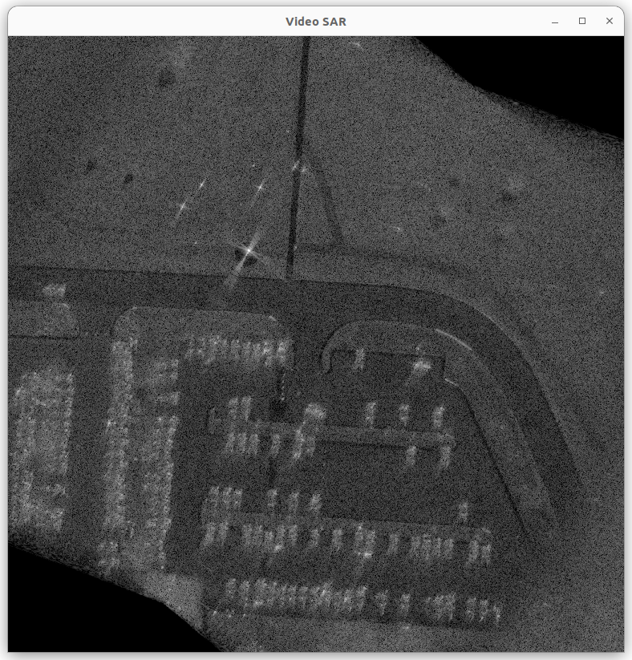
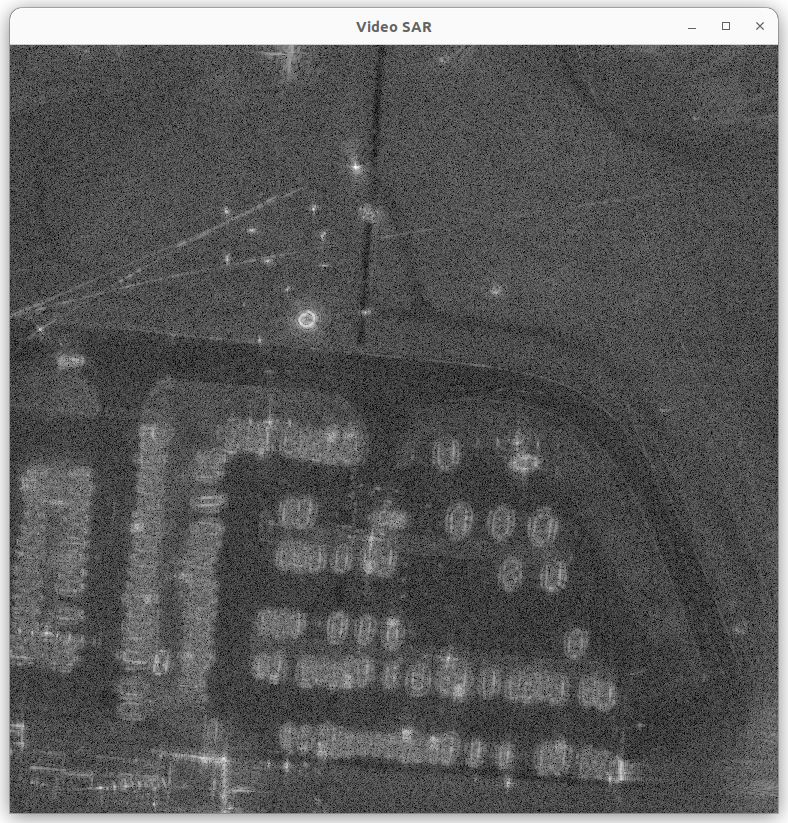

# GOTCHA-Back Overview

This repository includes CUDA-based implementations of synthetic aperture radar (SAR) backprojection for the GOTCHA data set available from the Air Force Research Lab at:

https://www.sdms.afrl.af.mil/index.php?collection=gotcha

The data is freely downloadable, although users must first create an account before downloading the data. The specific data files used for this work are `Gotcha-CP-Disc1.zip` and `Gotcha-CP-Disc2.zip` (i.e. the GOTCHA challenge problem data). The data has been pre-processed to reduce its field of view and a motion compensation algorithm has been applied so that the scene center has zero phase.

The data in the zip archives is stored in MATLAB data files, specifically an older MATLAB format (version 5.0). The MATLAB file format(s) are documented here:

https://www.mathworks.com/help/pdf_doc/matlab/matfile_format.pdf

This repository includes a minimal parser that supports the small set of features needed to extract the relevant data from the `.mat` files. The parser in `Gotcha::Reader` is not a general-purpose MATLAB file parser; for that, check the https://github.com/tbeu/matio project.

This is a hobbyist project to test out different optimization strategies. The GOTCHA data set includes multiple passes (i.e. the data includes multiple passes of an airborne platform around the scene), so possible future extensions to this work could include image registration, coherent change detection (CCD), etc. For now, the repository implements a few relatively straightforward optimizations.

If you would like to discuss the project, please contact the author (Thomas Benson) at tbensongit@gmail.com.

# Dependencies and Requirements

Dependencies include CMake (3.23+), CUDA, Boost (only the `program_options` library), and FLTK. Note that an NVIDIA GPU is required to run the GPU-based backprojectors (including the video SAR mode). To date, this code has been developed on Ubuntu 22.04 with CUDA 12, although other reasonably new Linux distributions should work as well. For Ubuntu, new versions of CMake are available via Kitware's APT repository (https://apt.kitware.com). The new vesion of CMake is only required to default to building the CUDA kernels for the GPUs installed on the system where the software is being built. The architecture can also be specified explicitly using e.g. `CUDAARCHS=86 make` to build for compute capability 8.6. In that case, the CMake minimum version can be dropped to 3.18.

# Building the Code

This project uses CMake, but it also includes a top-level `Makefile`, so if all dependencies are installed, then simply running `make` should be sufficient. By default, the build directory is `build-release` and the compiled executable is `build-release/sarbp`.

# Running the Backprojector

`sarbp` includes the following options:

```
./build-release/sarbp 
Usage: ./build-release/sarbp [options] <gotcha-dir>
Allowed options:
  -h [ --help ]                         help message
  --first-az arg (=38)                  First azimuthal angle to use for 
                                        reconstruction
  --last-az arg (=41)                   Last azimuthal angle to use for 
                                        reconstruction
  --kern arg (=1)                       GPU kernel to use for backprojection
  --pass arg (=1)                       Data pass to use for reconstruction
  --gotcha-dir arg                      Path to GOTCHA directory containing 
                                        GOTCHA-CP_Disc1 subdirectory
  --gpu arg                             Enables GPU-based backprojection on the
                                        specified device
  --ser arg                             Compute signal-to-error db metric 
                                        against reference image
  --video arg                           Enables video mode using specified 
                                        device to render data to the GUI
  -o [ --output-file ] arg (=image.bin) Output filename for reconstructed image
```

The only required argument is the `<gotcha-dir>` positional argument. This should be a filesystem path to the directory in which the zipped GOTCHA data sets have been unpacked. Specifically, it should include a `GOTCHA-CP_Disc1` subdirectory from the zip archive (for now, we only use Disc1; it has 7 of the 8 available passes). Running just the following:

```
./build-release/sarbp /path/to/gotcha-data
```

will use a reference CPU backprojector to reconstruct data from the first pass from azimuth angles 38-41 degrees and store the result in `image.bin`. The `first-az`, `--last-az`, and `--pass` options allow you to reconstruct a different subset of data. The `--gpu <device-id>` argument uses the CUDA-enabled GPU with device ID `<device-id>` to perform the backprojection. The `--kern` option selects among a set of GPU kernels with various optimizations.

There are various accuracy and performance trade-offs, especially related to the floating point precision of variables and operations (i.e. double vs single vs reduced). SAR backprojection in general has some operations that require better than 32-bit floating point precision, so optimizations on consumer GPUs with reduced throughput double precision is particularly challenging. For example, this work has been done on an RTX 3060, which has 64x higher throughput for single precision floating point relative to double precision. The optimal kernel thus may be different on an `A100` or `H100` with full FP64 throughput (i.e. half that of FP32 instead of 1/64th that of FP32 as on the 3060).

The `--ser <gold.bin>` argument computes a signal-to-error ratio in units of decibels between the generated image and `<gold.bin>`. One option is to use the CPU backprojector to generate an image, copy that image to `<gold.bin>`, and then e.g. run GPU backprojectors using `<gold.bin>` for validation. The gold image used in the SER calculation must be generated from the same pass and azimuth range or the error will be very large. For the SER metric, larger numbers are better, with values greater than 120 dB being near perfect matches. I typically aim for greater than 60 dB, although visually the images look reasonable with smaller SER values. However, it may be that applying e.g. coherent change detection requires higher accuracy.

Finally, there is a video SAR mode (`--video <device-id>`) that generates a sequence of images from consecutive ranges of azimuth extents. The video SAR mode is a work-in-progress. Currently, the window is draw via FLTK. There is a pulldown menu to choose the various GPU kernels. The video SAR mode is not yet optimized, other than letting you choose the kernel. Since the backprojection process is linear, other options are available, such as using a rolling window for accumulating backprojected images. Ultimately, the goal is to implement coherent change detection and overlay the coherence map from multiple passes on the SAR image.

Below is a sample screenshot from the video SAR mode using 20 degrees of data (this window and the next is drawn using GLUT rather than the current FLTK).



The scene includes a parking lots with cars and several calibration points, including a top hat. A top hat looks like what it sounds like: a cylindrical segment on top of a plate. A top hat provides strong reflections from any azimuth angle, assuming a typical elevation angle.

Using all 360 degrees of data, we get the following image.



In this image, the top hat is clearly visible as the bright circular object. The reconstructed image is normally resampled to the window dimensions via bilinear interpolation. Immediately after resizing a window, the image will be resampled via nearest neighbor interpolation to reduce the lag in drawing the window, but future interpolations to that window size will be done using bilinear interpolation.

# Kernel Selection Options

The optimizations included thus far are a subset of those presented in the following presentation from the 2013 GPU Technology Conference:

https://on-demand.gputechconf.com/gtc/2013/presentations/S3274-Synthetic-Aperture-Radar-Backprojection.pdf

There are currently six kernels (i.e. `--kern 1` through `--kern 6`). Briefly, the kernels are as follows:

- 1 - Double precision
- 2 - Mixed precision
- 3 - Incremental phase calculations to reduce the number of FP64 sine/cosine calculations
- 4 - Newton-Raphson iterations instead of FP64 `sqrt()`.
- 5 - Pre-compute some FP64 range calculations in shared memory to avoid redundant FP64 calculations in threads
- 6 - Texture sampling for interpolating range profiles
- 7 - Single precision

The performance metric computed by the code is giga backprojections per second (GBP/s). A single backprojection includes the calculations to accumulate the contributions from a single pixel in a single pulse. With an N by N image and P pulses, there are thus `N*N*P` total backprojection operations.

| Kernel  | SER (dB) | GBP/s Titan RTX | GBP/s RTX 3060 |
| ------------- | ------------- | ------------- | ------------- |
| 1 (FP64) | ~126 | 3.88 | 1.58 |
| 2 (Mixed) | ~78 | 5.41 | 2.06 |
| 3 (Incr Phase Calcs) | ~83 | 9.12 | 3.53 |
| 4 (Newton-Raphson) | ~82 | 10.69 | 4.15 |
| 5 (Smem Range Calcs) | ~81 | 15.22 | 6.08 |
| 6 (Texture Sampling) | ~73 | 15.10 | 5.97 |
| 7 (Single Precision) | ~15 | 80.76 | 71.8 |

The Titan RTX has 1/32nd double precision throughput relative to single precision throughput whereas the RTX 3060 has 1/64th FP64 relative to FP32. The Titan RTX thus has ~1.3x and ~2.6x higher FP32 and FP64 throughput, respectively, relative to the 3060. The higher FP64 performance of the Titan RTX is very noticeable in all of the kernels that involve FP64 calculations, but the single precision kernel is closer to parity between the two GPUs.

The SER value for the single precision implementation is likely too low for tasks that utilize the phase information of the pixels, although it is visually still reasonable if only using the magnitude image. The currently implemented optimizations close the performance gap between a version with high accuracy and the FP32 version to about 5.3x and 12x for the Titan RTX and RTX 3060, respectively. Using texture sampling in this case did not improve performance, seemingly because the high-precision kernels are already heavily compute-bound due to the double-precision computations.

In general, it is clear that if accurate phase information is required, which in turn requires some double-precision arithmetic, then hardware with higher double-precision throughput is necessary. In practice, that means that the x100 series GPUs are needed (e.g. V100, A100, H100), but no consumer variants of those architectures are available.

# Potential Future Work

There are several items still to be done, including:

- More optimization work on the kernels, including thread coarsening, cache hierarchy optimization, etc.
- The video SAR mode can also be significantly optimized, especially in the case of subsequent images using partially overlapping pulse ranges. Since multiple passes are available, simultaneously constructing data from multiple passes and performing on-the-fly coherent change detection is also an option.
- Optimized CPU implementations.

Also, the current data sets are quite small as they are pre-processed to a small scene. If anyone has any large interesting SAR data sets available that they are willing to share, please contact me at tbensongit@gmail.com.